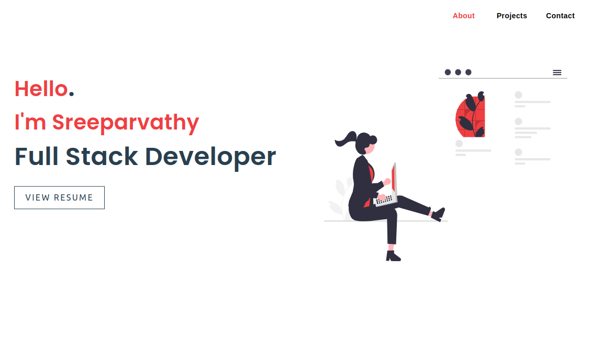

# Portfolio App

This is a sleek and functional portfolio application built with React and Vite. It is designed to highlight my skills, showcase projects, and provide contact information.

## Features
- Introduction: A brief overview of who I am.
- Projects: A section showcasing my key projects.
- Contact: Information on how to get in touch with me.

## Steps to run the application

I have used node v20.12.2 (npm v10.5.0)

1. Clone the repository
2. Install dependencies using - npm i 
3. Start the development server and open your application in the browser using - npm run dev

